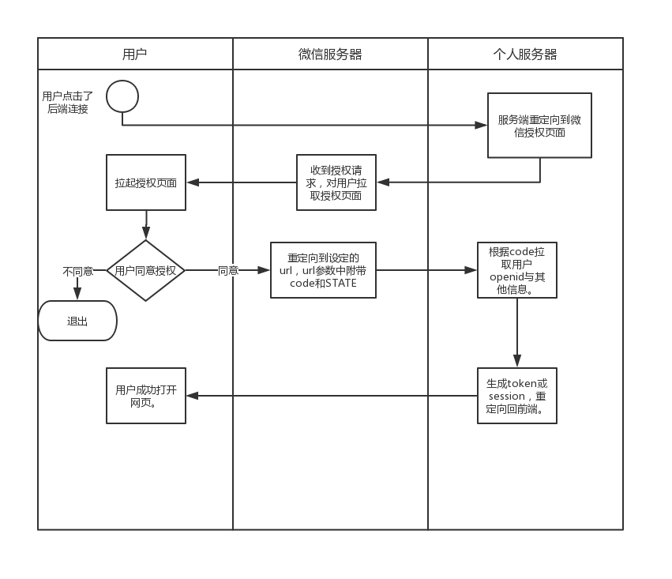
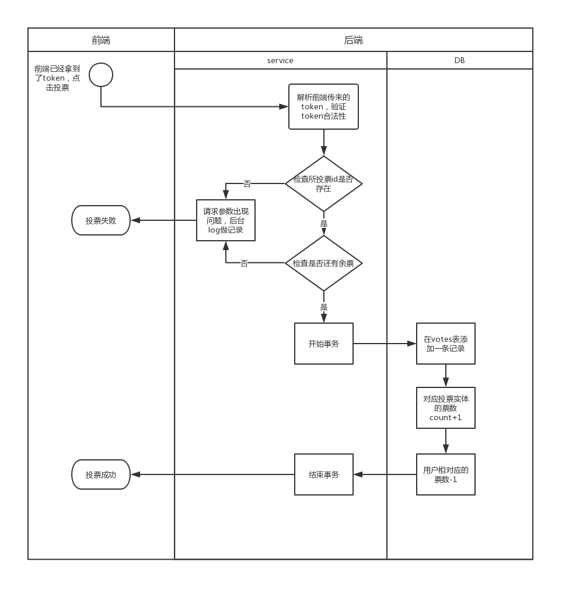
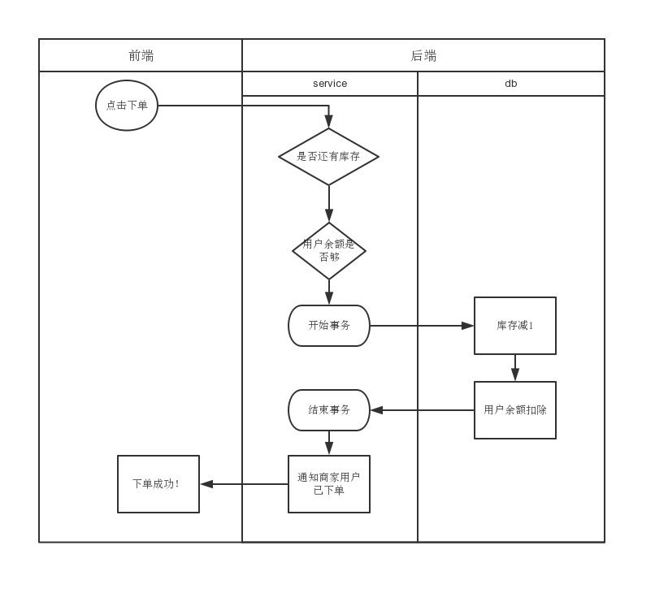

# 业务模型

> 今天讲的一共会涉及到三种业务模型：投票、积分商城、抽奖。
>
> 每个模型我们从三个角度来讲解：DB、流程、设计。
>
> 并且每个模型我们会抽出一些共有的模块，在后面的课程再进行讲解

## 微信公众号开发

> 详见 [微信公众平台开发文档](https://mp.weixin.qq.com/wiki)

目前我们使用微信开发，用户的信息全部通过微信进行oauth来获得。在这个过程中，从oauth中获得的用户识别码称为openid。一个用户对应一个微信公众号(微信小程序)是唯一的。开发者可以通过这个openid来识别一个唯一的用户。

对于在微信开发的模型下，我们省略了用户登陆这一个步骤，只需要经过用户授权便可以拿到一个用户身份。




## 投票系统

### 数据库表设计

用户表

```sql
CREATE TABLE `user`  (
  `id` int(0) UNSIGNED NOT NULL AUTO_INCREMENT,
  `openid` varchar(256) NOT NULL,
  PRIMARY KEY (`id`),
  UNIQUE INDEX `openid`(`openid`) USING HASH
) ENGINE = InnoDB;
```

投票表

```sql
CREATE TABLE `votes`  (
  `id` int(0) UNSIGNED NOT NULL AUTO_INCREMENT,
  `uid` int(0) NOT NULL,
  `entity_id` int(0) NOT NULL,
  `timestamp` varchar(10) NOT NULL,
  PRIMARY KEY (`id`),
  INDEX `uid`(`uid`) USING BTREE,
  INDEX `entity_id`(`entity_id`) USING BTREE
);
```

实体表

```sql
CREATE TABLE `entity` (
  `id` int(10) unsigned NOT NULL AUTO_INCREMENT,
  `name` varchar(255) NOT NULL,
  PRIMARY KEY (`id`)
) ENGINE=InnoDB
```

### 流程图



## 商城系统



## 抽奖系统

> 🐏卷平学姐现在接到了一个黑锅，需要她在弹幕上设计一个口令红包来让全学校的学生进行一个抽奖活动。聪明的你一定能帮助学姐完成这个任务的吧？